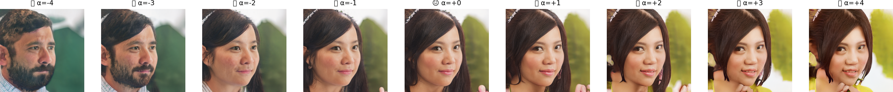

# FaceGAN: 基于 GAN 的人脸生成与性别控制系统

基于 NVIDIA StyleGAN2-ADA 和 InterFaceGAN 潜空间操控，实现 1024x1024 高保真人脸生成与连续性别属性控制。



## 功能特性

- **随机人脸生成** — 1024x1024 逼真人脸，每次生成独一无二的身份
- **性别控制** — 通过 W 空间线性方向实现男女性别连续调节
- **性别渐变** — 同一身份从男性到女性的平滑 morphing，身份信息不变
- **截断分析** — 探索截断技巧对生成质量与多样性的影响
- **批量导出** — 生成并保存多张人脸到本地

## 演示方式

| 界面 | 命令 | 适用场景 |
|------|------|---------|
| Gradio Web | `python app.py` | 答辩现场演示 |
| Jupyter Notebook | `jupyter notebook demo.ipynb` | 代码提交、交互探索 |
| 命令行 | `python scripts/generate_figures.py` | 批量生成报告图表 |

Web 界面提供 5 个 Tab：交互式控制、性别渐变、批量画廊、批量导出、截断分析。

## 快速开始

### 环境要求

- Python 3.9+，PyTorch 2.x + CUDA
- NVIDIA GPU，6GB+ 显存（已在 RTX 4060 上测试）
- 约 2GB 磁盘空间（存放模型权重）

### 安装

```bash
conda create -n facegan python=3.9
conda activate facegan

pip install torch torchvision --index-url https://download.pytorch.org/whl/cu118
pip install gradio open-clip-torch scikit-learn tqdm matplotlib pillow requests
pip install ninja  # 可选，消除 CUDA 编译警告
```

### 下载权重

```bash
# 下载 NVIDIA 官方 FFHQ 模型（约 380MB）
python scripts/download_official.py

# 克隆 NVIDIA StyleGAN2-ADA 源码（仅需一次）
git clone --depth 1 https://github.com/NVlabs/stylegan2-ada-pytorch.git official
```

### 计算性别方向

```bash
python scripts/compute_gender.py
```

该脚本的工作流程：
1. 随机生成 10000 张人脸
2. 使用 CLIP 零样本分类每张为男性/女性
3. 在 W 空间训练线性 SVM 找到性别决策超平面
4. 超平面法向量即为性别操控方向（保存至 `weights/gender_dir_official.pt`）

预计耗时约 5-8 分钟。

### 启动

```bash
# Web 演示（答辩推荐）
python app.py
# 浏览器打开 http://localhost:7860

# Jupyter Notebook
jupyter notebook demo.ipynb

# 批量生成图表素材
python scripts/generate_figures.py
# 输出到 figures/ 目录
```

## 技术原理

### 整体架构

```
z ~ N(0,I)  -->  Mapping Network (8层MLP)  -->  W 空间 (512维)
                                                    |
                                          + gender_dir * alpha
                                                    |
                                                    v
Learned Constant (4x4x512) --> Synthesis Network (18层ModConv) --> 1024x1024 RGB
```

### 生成模型

- **架构**：StyleGAN2-ADA（Karras et al., NeurIPS 2020），使用 NVIDIA 官方 PyTorch 实现
- **权重**：FFHQ 数据集预训练（7 万张高清人脸）
- **参数量**：约 3000 万

### 性别控制（InterFaceGAN）

基于 StyleGAN2 的 W 空间中语义属性对应线性方向的发现（Shen et al., CVPR 2020）：

$$W' = W + \alpha \cdot \mathbf{d}_{gender}$$

- 性别方向 $\mathbf{d}_{gender}$ 通过 CLIP 标注 + 线性 SVM 在 W 空间训练得到
- $\alpha < 0$：偏男性 | $\alpha > 0$：偏女性
- 仅改变性别属性，身份、肤色、背景等其他特征保持不变

## 项目结构

```
FaceGAN/
├── app.py                   # Gradio Web 演示系统
├── demo.ipynb               # Jupyter Notebook（可导出 HTML 提交）
├── src/
│   ├── silence_ops.py       # 禁用 CUDA 编译（纯 PyTorch 推理）
│   └── latent_tools.py      # 性别分类器 + SVM 方向查找
├── scripts/
│   ├── compute_gender.py    # 计算性别操控方向（CLIP + SVM）
│   ├── download_official.py # 下载 NVIDIA FFHQ 权重
│   ├── generate_figures.py  # 批量生成报告/PPT 图表
│   └── setup.sh             # 环境安装脚本
├── official/                # NVIDIA StyleGAN2-ADA 源码（git clone）
├── weights/                 # 模型权重
│   ├── ffhq.pkl            # FFHQ 预训练模型（~380MB）
│   └── gender_dir_official.pt  # 性别方向向量（~38KB）
├── figures/                 # 生成的图表素材
├── outputs/                 # 批量导出的图片
└── docs/                    # 文档（课程设计报告、PPT大纲、答辩准备等）
```

## 参考文献

- Karras, T. et al. "Analyzing and Improving the Image Quality of StyleGAN." CVPR, 2020.
- Karras, T. et al. "Training Generative Adversarial Networks with Limited Data." NeurIPS, 2020.
- Shen, Y. et al. "InterFaceGAN: Interpreting the Disentangled Face Representation Learned by GANs." TPAMI, 2020.
- Radford, A. et al. "Learning Transferable Visual Models From Natural Language Supervision." ICML, 2021.
- Goodfellow, I. et al. "Generative Adversarial Networks." NeurIPS, 2014.

## 许可证

本项目使用了 [NVIDIA StyleGAN2-ADA](https://github.com/NVlabs/stylegan2-ada-pytorch)（NVIDIA Source Code License）以及 FFHQ 数据集预训练权重（Creative Commons BY-NC-SA 4.0）。
